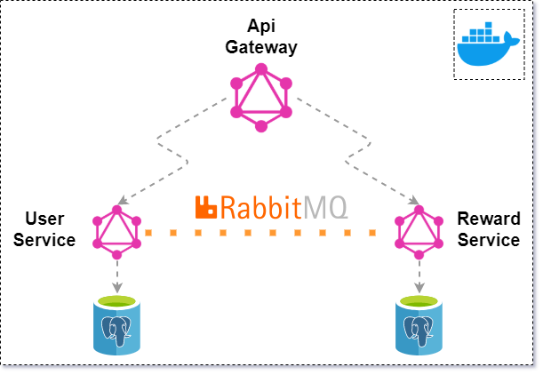

## Microservice Project

This project is an application that exemplifies the microservice architecture. In the project, there is a scenario about the user and the awards received by the user.


## Tech Stack

**Node.js** + **GraphQL** + **RabbitMQ** + **PostgreSQL** + **Apollo** + **Sequelize** 


## Summary

* Fully isolated GraphQL microservices are served to the outside world with the **GraphQL Api Gateway**.
* Schema reading was done directly from microservices using [Apollo/Gateway](https://www.npmjs.com/package/@apollo/gateway) and [Apollo/Federation](https://www.npmjs.com/package/@apollo/federation). In this way, [Open/Closed Principle](https://en.wikipedia.org/wiki/Open%E2%80%93closed_principle) is provided for **Api Gateway**.
* ORM (Sequelize) and GraphQL were combined with the "graphql-sequelize" package in the microservice. In this way, automatic resolver operation is performed according to model types.
* Communication between **RabbitMQ** and microservices has been provided.
* **PostgreSQL** is used as database. There is a separate database for each microservice.
* Every service that has a Many-To-Many relationship has tables that store this relationship. The relationship between discrete microservices is provided in this way. *(For User-Reward, each microservice has a common UserReward table.)*
* Prepared for installation using **Docker**.


## Installation

```
cd nodejs-microservices/src
docker-compose up
```